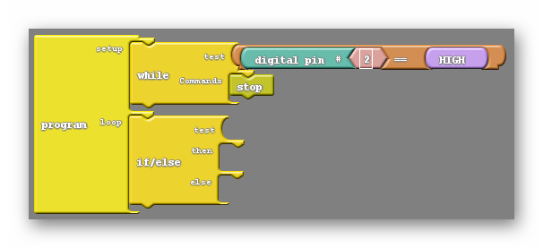
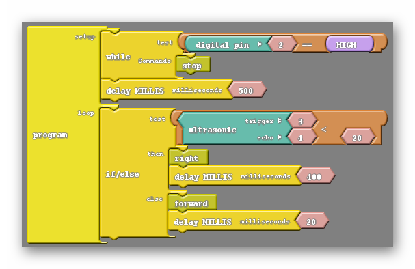

### Overview

In this section we'll combine everything to program our car to move and avoid objects


<div markdown = "1">


### The Math behind ultrasonic code for Arduino, Stopping Robot At A Wall 2WD



Note: This uses pins 4 and 5 for trigger and echo connections, respectively.

</div>{:.text-based}


### Stop Before We Crash

Let's program that car to stop before we hit a wall!  Let's use what we have learned about the ultrasonic sensor to program our robot to do this.  We'll need to use if/else.

{:.image .block-based}

{:.block-based}
```c
int motb_pin1 = 3;
int motb_pin2 = 11;

int mota_pin1 = 9;
int mota_pin2 = 10;

int button_pin = 2;

int trig_pin = 4;
int echo_pin = 5;

void setup() {
  
  //-Control Motor B
  pinMode(motb_pin1,OUTPUT);
  pinMode(motb_pin2,OUTPUT);
  
  //-Control Motor A
  pinMode(mota_pin1,OUTPUT);
  pinMode(mota_pin2,OUTPUT);
  
  //- button
  pinMode(button_pin,INPUT_PULLUP);
  
  //-ultrasonic pin
  pinMode(trig_pin,OUTPUT);
  pinMode(echo_pin,INPUT);
  
  Serial.begin(9600);
  
}

//-sends sound out and receives sound
//-returns the distance in centimeters
int ultrasonic() {
  
  long time;
  float distance;
  
  //-trigger a sound 
  // send out trigger signal
  digitalWrite(trig_pin, LOW);
  delayMicroseconds(2);
  digitalWrite(trig_pin, HIGH);
  delayMicroseconds(20);
  digitalWrite(trig_pin, LOW);
  
  //- a sound has gone out!!
  //- wait for a sound to come back
  
  time = pulseIn(echo_pin, HIGH);
  
  //- calculate the distance in centimeters
  distance = 0.01715 * time;
  
  return distance;

}

//- turn 90 degrees
void turnRight() {
  
  //- motor b is stopped
  analogWrite(motb_pin1,0);
  analogWrite(motb_pin2,0);
  
  //- motor a moves forward
  analogWrite(mota_pin1,255);
  analogWrite(mota_pin2,0);
  
  delay(600);
  
  //- stop motor a
  analogWrite(mota_pin1,0);
  analogWrite(mota_pin2,0);
  
}

void turnLeft() {
  
  //- motor a is stopped
  analogWrite(mota_pin1,0);
  analogWrite(mota_pin2,0);
  
  //- motor b moves forward
  analogWrite(motb_pin1,0);
  analogWrite(motb_pin2,255);
  
  delay(800);
  
  //- stop motor b
  analogWrite(motb_pin1,0);
  analogWrite(motb_pin2,0);
  
}

void stop() {
  //- motor a
  analogWrite(mota_pin1,255);
  analogWrite(mota_pin2,255);
  
  //- motor b
  analogWrite(motb_pin1,255);
  analogWrite(motb_pin2,255);
}


void moveToWall(int speeda, int speedb) {
  
  //- move forward!
  //- motor a
  analogWrite(mota_pin1,speeda);
  analogWrite(mota_pin2,0);
  
  //- motor b
  analogWrite(motb_pin1,0);
  analogWrite(motb_pin2,speedb);
  
  //-stop when you hit a wall!!
  
  int distance = ultrasonic();
  
  while (distance > 5) {
    //-do nothing except check distance
    distance = ultrasonic();
  }
  
  //-stop!!!
  stop();
  
}


void moveForward(int speeda, int speedb, int inches) {
  
  int myDelay;
  
  //- motor a
  analogWrite(mota_pin1,speeda);
  analogWrite(mota_pin2,0);
  
  //- motor b
  analogWrite(motb_pin1,0);
  analogWrite(motb_pin2,speedb);
  
  //- move forward the distance in inches
  
  
  
  myDelay = inches*125;
  delay(myDelay);
  
  //- stop
  stop();
  
}

void moveBackward(int speeda, int speedb) {
  
  //- motor a
  analogWrite(mota_pin1,0);
  analogWrite(mota_pin2,speeda);
  
  //- motor b
  analogWrite(motb_pin1,speedb);
  analogWrite(motb_pin2,0);
  
}


void loop() {
  
  Serial.println(ultrasonic());
  
  delay(100);
  
  
  if (digitalRead(button_pin)==LOW) {
      moveToWall(120,120);
  }
  else {
    stop();
  }

}
```
{:.text-based}


### Turn Before We Crash

Let's program our car to not only stop before we hit a wall, but also turn to avoid it!


Let's program the robot to turn right if it sees an object less than 20 cm away, else move forward.   See the code below.

{:.image .block-based}

Note: The 400 ms delay after the right subroutine determines how long it will turn right for before moving on to the next section of code.{:.block-based}

```c
int motb_pin1 = 3;
int motb_pin2 = 11;

int mota_pin1 = 9;
int mota_pin2 = 10;

int button_pin = 2;

int trig_pin = 4;
int echo_pin = 5;

void setup() {
  
  //-Control Motor B
  pinMode(motb_pin1,OUTPUT);
  pinMode(motb_pin2,OUTPUT);
  
  //-Control Motor A
  pinMode(mota_pin1,OUTPUT);
  pinMode(mota_pin2,OUTPUT);
  
  //- button
  pinMode(button_pin,INPUT_PULLUP);
  
  //-ultrasonic pin
  pinMode(trig_pin,OUTPUT);
  pinMode(echo_pin,INPUT);
  
  Serial.begin(9600);
  
}

//-sends sound out and receives sound
//-returns the distance in centimeters
int ultrasonic() {
  
  long time;
  float distance;
  
  //-trigger a sound 
  // send out trigger signal
  digitalWrite(trig_pin, LOW);
  delayMicroseconds(2);
  digitalWrite(trig_pin, HIGH);
  delayMicroseconds(20);
  digitalWrite(trig_pin, LOW);
  
  //- a sound has gone out!!
  //- wait for a sound to come back
  
  time = pulseIn(echo_pin, HIGH);
  
  //- calculate the distance in centimeters
  distance = 0.01715 * time;
  
  return distance;

}

//- turn 90 degrees
void turnRight() {
  
  //- motor b is stopped
  analogWrite(motb_pin1,0);
  analogWrite(motb_pin2,0);
  
  //- motor a moves forward
  analogWrite(mota_pin1,255);
  analogWrite(mota_pin2,0);
  
  delay(600);
  
  //- stop motor a
  analogWrite(mota_pin1,0);
  analogWrite(mota_pin2,0);
  
}

void turnLeft() {
  
  //- motor a is stopped
  analogWrite(mota_pin1,0);
  analogWrite(mota_pin2,0);
  
  //- motor b moves forward
  analogWrite(motb_pin1,0);
  analogWrite(motb_pin2,255);
  
  delay(800);
  
  //- stop motor b
  analogWrite(motb_pin1,0);
  analogWrite(motb_pin2,0);
  
}

void stop() {
  //- motor a
  analogWrite(mota_pin1,255);
  analogWrite(mota_pin2,255);
  
  //- motor b
  analogWrite(motb_pin1,255);
  analogWrite(motb_pin2,255);
}


void moveToWall(int speeda, int speedb) {
  
  //- move forward!
  //- motor a
  analogWrite(mota_pin1,speeda);
  analogWrite(mota_pin2,0);
  
  //- motor b
  analogWrite(motb_pin1,0);
  analogWrite(motb_pin2,speedb);
  
  //-stop when you hit a wall!!
  
  int distance = ultrasonic();
  
  while (distance > 5) {
    //-do nothing except check distance
    distance = ultrasonic();
  }
  
  //-stop!!!
  stop();
  
}


void moveForward(int speeda, int speedb, int inches) {
  
  int myDelay;
  
  //- motor a
  analogWrite(mota_pin1,speeda);
  analogWrite(mota_pin2,0);
  
  //- motor b
  analogWrite(motb_pin1,0);
  analogWrite(motb_pin2,speedb);
  
  //- move forward the distance in inches
  
  
  
  myDelay = inches*125;
  delay(myDelay);
  
  //- stop
  stop();
  
}

void moveBackward(int speeda, int speedb) {
  
  //- motor a
  analogWrite(mota_pin1,0);
  analogWrite(mota_pin2,speeda);
  
  //- motor b
  analogWrite(motb_pin1,speedb);
  analogWrite(motb_pin2,0);
  
}


void loop() {
  
  Serial.println(ultrasonic());
  
  delay(100);
  
  
  if (digitalRead(button_pin)==LOW) {
      moveToWall(120,120);
      turnRight();
  }
  else {
    moveForward();
  }

}
```
{:.text-based}


### Adding Delays 

Let's add some delays into our code to increase our performance.

1. Adding a 500 ms delay after the while loop will give us time to remove our hand from the robot after pressing it.  This is to help prevent us from accidently bumping the robot off its course.
2. Adding a 20 ms delay after the forward subroutine adds a little time for the code to rest before it loops back to the ultrasonic part of the code.  Without the rest, the ultrasonic sensor may malfunction from time to time by getting overloaded by requests.

{:.image .block-based}

```c
int motb_pin1 = 3;
int motb_pin2 = 11;

int mota_pin1 = 9;
int mota_pin2 = 10;

int button_pin = 2;

int trig_pin = 4;
int echo_pin = 5;

void setup() {
  
  //-Control Motor B
  pinMode(motb_pin1,OUTPUT);
  pinMode(motb_pin2,OUTPUT);
  
  //-Control Motor A
  pinMode(mota_pin1,OUTPUT);
  pinMode(mota_pin2,OUTPUT);
  
  //- button
  pinMode(button_pin,INPUT_PULLUP);
  
  //-ultrasonic pin
  pinMode(trig_pin,OUTPUT);
  pinMode(echo_pin,INPUT);
  
  Serial.begin(9600);
  
}

//-sends sound out and receives sound
//-returns the distance in centimeters
int ultrasonic() {
  
  long time;
  float distance;
  
  //-trigger a sound 
  // send out trigger signal
  digitalWrite(trig_pin, LOW);
  delayMicroseconds(2);
  digitalWrite(trig_pin, HIGH);
  delayMicroseconds(20);
  digitalWrite(trig_pin, LOW);
  
  //- a sound has gone out!!
  //- wait for a sound to come back
  
  time = pulseIn(echo_pin, HIGH);
  
  //- calculate the distance in centimeters
  distance = 0.01715 * time;
  
  return distance;

}

//- turn 90 degrees
void turnRight() {
  
  //- motor b is stopped
  analogWrite(motb_pin1,0);
  analogWrite(motb_pin2,0);
  
  //- motor a moves forward
  analogWrite(mota_pin1,255);
  analogWrite(mota_pin2,0);
  
  delay(600);
  
  //- stop motor a
  analogWrite(mota_pin1,0);
  analogWrite(mota_pin2,0);
  
}

void turnLeft() {
  
  //- motor a is stopped
  analogWrite(mota_pin1,0);
  analogWrite(mota_pin2,0);
  
  //- motor b moves forward
  analogWrite(motb_pin1,0);
  analogWrite(motb_pin2,255);
  
  delay(800);
  
  //- stop motor b
  analogWrite(motb_pin1,0);
  analogWrite(motb_pin2,0);
  
}

void stop() {
  //- motor a
  analogWrite(mota_pin1,255);
  analogWrite(mota_pin2,255);
  
  //- motor b
  analogWrite(motb_pin1,255);
  analogWrite(motb_pin2,255);
}


void moveToWall(int speeda, int speedb) {
  
  //- move forward!
  //- motor a
  analogWrite(mota_pin1,speeda);
  analogWrite(mota_pin2,0);
  
  //- motor b
  analogWrite(motb_pin1,0);
  analogWrite(motb_pin2,speedb);
  
  //-stop when you hit a wall!!
  
  int distance = ultrasonic();
  
  while (distance > 5) {
    //-do nothing except check distance
    distance = ultrasonic();
  }
  
  //-stop!!!
  stop();
  
}


void moveForward(int speeda, int speedb, int inches) {
  
  int myDelay;
  
  //- motor a
  analogWrite(mota_pin1,speeda);
  analogWrite(mota_pin2,0);
  
  //- motor b
  analogWrite(motb_pin1,0);
  analogWrite(motb_pin2,speedb);
  
  //- move forward the distance in inches
  
  
  
  myDelay = inches*125;
  delay(myDelay);
  
  //- stop
  stop();
  
}

void moveBackward(int speeda, int speedb) {
  
  //- motor a
  analogWrite(mota_pin1,0);
  analogWrite(mota_pin2,speeda);
  
  //- motor b
  analogWrite(motb_pin1,speedb);
  analogWrite(motb_pin2,0);
  
}


void loop() {
  
  Serial.println(ultrasonic());
  
  delay(100);
    
  if (digitalRead(button_pin)==LOW) {
      delay(500);
      moveToWall(120,120);
      turnRight();
  }
  else {
    moveForward();
      delay(20);
  }

}
```
{:.text-based}

<div markdown = "1">

### Improving Our Ultrasonic Sensor's Performance 

As your robot's battery gets drained, it's a known issue that the ultrasonic sensor will begin responding with 0 even when there is something in front of it.  We can actually take care of this through code by ignoring 0 values.  The AND block helps us do this.


Note: In the code above, the robot will turn right ONLY if the ultrasonic sensor sees a value that is less than 20 AND it's not 0.  




</div>{:.block-based}

