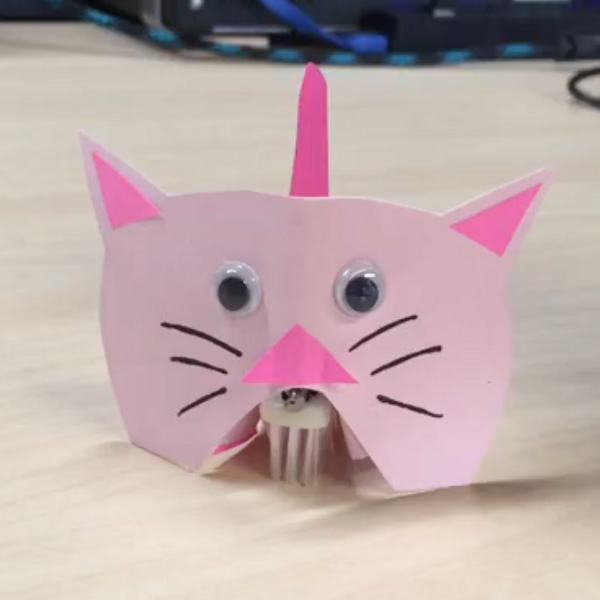

{:class="image "}

### Introductions and Ice Breaker (5 min)
- Let your students know that they will be building a robot today.  
   * E.g. "We are going to BUILD something and LEARN about engineering.  We are also going to have FUN!"
* Hand out engineering worksheets, and ask the students to write their names at the top.
   * If you don’t have engineering worksheets, you can also improvise with any blank sheet of paper.
* Ask the students to introduce themselves.  Fun icebreaker questions:
   * What is your favorite food?
   * What is your favorite robot?  
* Introduce today’s project.

#### Introducing The Robot’s Heart (10 min)
* What does the human heart do for us?  It gives us energy by pumping blood.  It is the same for a robot.  His heart is something that gives him energy.  

#### Explain that the heart of the the robot is the battery.  And that the battery doesn't pump blood, but electricity!
* Now explain that the human heart only works if the blood is moving in a loop.  If it's not in a loop, then something is wrong!  It is the same thing with a robot.  Electricity has to move in a loop, otherwise it won't work.  This is where we introduce the concept of "open" and "closed".  
* VOCABULARY words:
   * ELECTRICITY: the movement of charged energy from one place to another.  Kind of like lightning.
   * CIRCUIT: the path of electricity
   * CLOSED: means that you can find a closed loop 
   * OPEN: means that you cannot find a closed loop

{:class="image "}

### Building The Robot’s Heart (10 min)
   * Building the robot's heart
   * Hand out the coincell battery and motor
   * Draw out the a diagram showing the loop that they want to make.  Explain that there is a positive and negative.  Draw a battery connected to a motor.  The example below is open-circuit because the loop is broken.  To make a closed-circuit, just fill in the line.

{:class="image "}

   * Have the kids try to create a working closed-circuit based on the drawing.  Have them experiment making a closed circuit (the motor should turn on) and an open-circuit (the motor should turn off).
   * We will now experiment with making a simple switch so that you can turn your robot on and off.
   * Hand out the double-stick foam strip
   * Take off the paper on only ONE side of the strip
   * Place your motor on the sticky side of the strip.  
   * Make sure that the spinny part can still spin
   * Put one of the wires on the sticky side of the strip.  The other wire should be sticking up in the air.
   * Place the battery onto the sticky foam.  Make sure that the side on the sticky foam is touching the metal part of the wire that is on the sticky foam.
   * Now using a sticker, connect the top wire and the top of the coincell battery.  
   * Watch video: Student experimenting with the motor and the sticker-made switch.

### Mechanics (5 min -- OPTIONAL)
   * Why does the motor vibrate?
   * Have the kids think about why the motor starts to vibrate.  Explain that it is because of the "spinny thing" on the motor shaft.  (It is actually called an "eccentric wheel.")  

When the eccentric wheel spins, its weight is distributed unevenly, causing it to vibrate (instead of spin smoothly).  Have the students shift their weight from side to side (like when using a hula hoop) and spin.  By doing this, they are acting like a vibration motor!  Compare this to spinning in place in a circle without shifting their weight from side to side.

### Adding The Robot’s Feet (5 min)
   * Draw the final mechanical design of the robot.

   * Hand out the toothbrush head your students.  The toothbrush is your robot’s feet.
   * Take off the other white paper of the double-stick foam and stick your robot motor and heart onto the toothbrush.  Your body is almost done!

### Designing The Robot's Body (5 min)
   * Show the kids the sample Critterbot.  Explain that it is now their job to design their robot's body.  This is what industrial designers do.  They need to make sure that their robot looks cool or cute. 
   * Give the students a few minutes to draw their robot’s design on their worksheet

### Decorate and Build The Body! (10 min)
   * Now that the design is done, it is time to build the body!  Bring out construction paper, glue, eyes, etc.
   * Tips on Building the Body
   * Cut two long pieces of construction paper to go along the side of the toothbrush.  Use double-stick tape to connect the construction paper to the toothbrush.  You can fold the ends of the construction paper out in order to give stability to your robot.  These ends can also be used to add a face, tail and/or shell.
   * Use pipe cleaners for hair or legs!
   * Add googly eyes!

{:class="image "}

#### Experiment! (5 min)
   * Once you are done, does it go forward?  Does it go in circles?  
   * Watch Critterbots in action! (Scarecrow, Bun Bun)
   * Possible challenges:
   * See if you can make it go straight
   * See if you can make it go in circles
   * See if you can make sure it doesn't fall down
   * If you have time, kids can try to race their robots or battle them

{:class="image "}
{:class="image "}
{:class="image "}
{:class="image "}