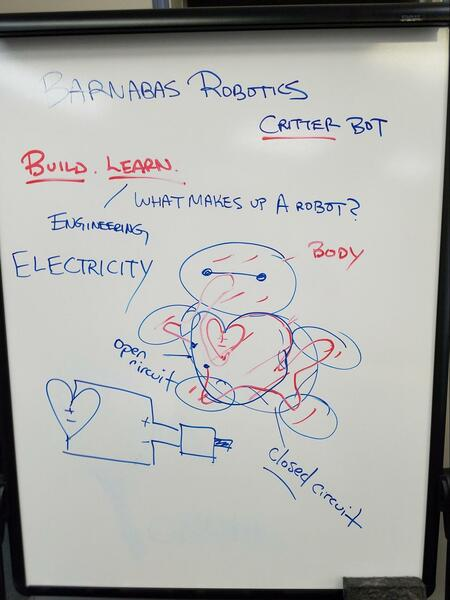

### Introductions (5 min)
* Tell the kids that we are going to build a robot today.  We're going to BUILD something, LEARN engineering from it, and we're going to have FUN!
* If this is the first day of class, introduce the attention getter.  I like to use: "Class!  Class!.. Yes! Yes!".  Spend a few minutes explaining why it is important that we do this.  We will be having lots of fun, but we need to quiet down so that we can hear the next instruction.
* Character Building Lesson:  I also recommend talking about perseverance 

### Introducing The Robot’s Body (5 min)
* Before we start, introduce that we are going to engineers today.  Engineers use math and science to build fun stuff!
* Draw BayMax on the board and explain how BayMax has a body.  Explain that every robot has a body, just like our robot.  Explain that a mechanical engineer is the one that works on the robot’s body. 
* Next, introduce the the medicine cup, and that today it will be the robot’s body!  Explain that the cup will be upside down, and not rightside up.

{:class="image "}

#### Creating Your Robot’s Clothes (10 min)
* Introducing The Stencil: Explain that we need to give skin to our robot.  Show how a stencil works.  Explain that we need to share the stencil with our neighbor.
* Pass out scissors and construction paper

#### Putting On Your Robot’s Clothes (5 min)
* Show how to attach the clothes using double-stick tape
* Make sure to go over how to orient the clothing.  It needs to be like a happy face!

#### Decorate The Body! (10 min)
* Show the kids the sample Medicine Cup Bot.  Explain that it is now their job to design their robot's body.  This is what industrial designers do.  They need to make sure that their robot looks cool or cute. 
* Give the students a few minutes to draw their robot’s design on their worksheet
* Hand out googly eyes, extra construction paper and tape
* Ideas
   * Give your medicine bot a neck or a tail!

{:class="image "}

### Learning About Our Robot’s Heart (5 min)
* Draw a heart on your BayMax drawing.
* What does the human heart do for us?  It gives us energy by pumping blood.  It is the same for a robot.  His heart is something that gives him energy.  

### Explain that the heart of the the robot is the battery.  And that the battery doesn't pump blood, but electricity!
* Now explain that the human heart only works if the blood is moving in a loop.  If it's not in a loop, then something is wrong!  It is the same thing with a robot.  Electricity has to move in a loop, otherwise it won't work.  This is where we introduce the concept of "open" and "closed".  
* VOCABULARY words:
   * ELECTRICITY: the movement energy from one place to another.  Kind of like lightning.
   * CIRCUIT: the path of electricity
   * CLOSED: means that you can find a closed loop 
   * OPEN: means that you cannot find a closed loop

#### Building The Robot’s Heart (5 min)
   * Building the robot's heart
   * Hand out the coincell battery and motor
   * Draw out the a diagram showing the loop that they want to make.  Explain that there is a positive and negative.  Draw a battery connected to a motor.  The example below is open-circuit because the loop is broken.  To make a closed-circuit, just fill in the line.

{:class="image "}

   * Have the kids try to create a working closed-circuit based on the drawing.  Have them experiment making a closed circuit (the motor should turn on) and an open-circuit (the motor should turn off).

### Mechanics (5 min -- OPTIONAL)
   * Why does the motor vibrate?
   * Have the kids think about why the motor starts to vibrate.  Explain that it is because of the spinny thing on the shaft.  It is called an eccentric wheel.  If the shaft is right in the middle of the disc, it actually won’t rotate.  This is because it is not off balance.  Instead, if it is on the side, it will.  When the motor spins, it puts its weight on different parts, which cause it to shake.  Have the students shift their weight from side to side and spin.  They are acting like a vibrating motor!  If they don't shift their weight from side to side while they spin, they won't bounce around... they will just spin in place.

#### Adding Our Heart To Our Body (5 min)
   * We will now experiment with making a simple switch so that you can turn your robot on and off.
   * Hand out the double-stick foam strip
   * Take off the paper on only ONE side of the strip
   * Place your motor on the sticky side of the strip.  
   * Make sure that the spinny part can still spin
   * Put one of the wires on the sticky side of the strip.  The other wire should be sticking up in the air.
   * Place the battery onto the sticky foam.  Make sure that the side on the sticky foam is touching the metal part of the wire that is on the sticky foam.
   * Now using a sticker, connect the top wire and the top of the coincell battery.  
   * Watch video: Student experimenting with the motor and the sticker-made switch.

### Experiment! (5 min)
   * Once you are done, does it go forward?  Does it go in circles?  
   * Watch Critterbots in action! (Scarecrow, Bun Bun)
   * Possible challenges:
   * See if you can make it go straight
   * See if you can make it go in circles
   * See if you can make sure it doesn't fall down
   * If you have time, kids can try to race their robots or battle them

{:class="image "}
