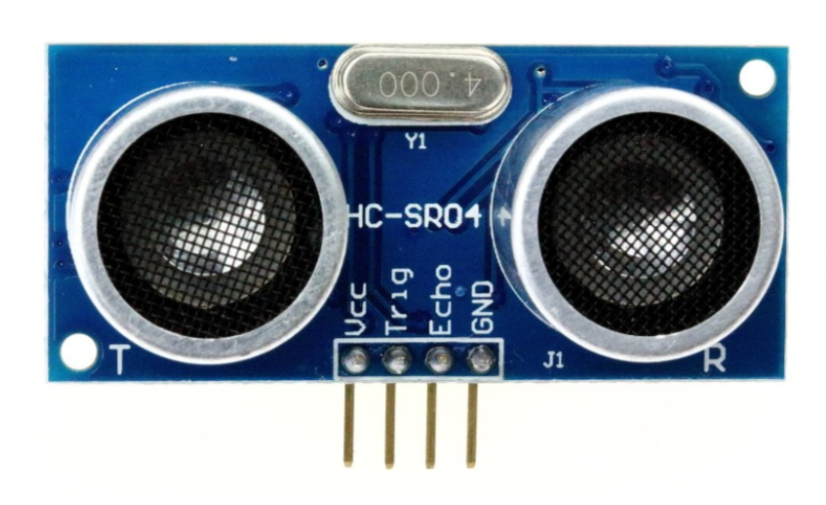
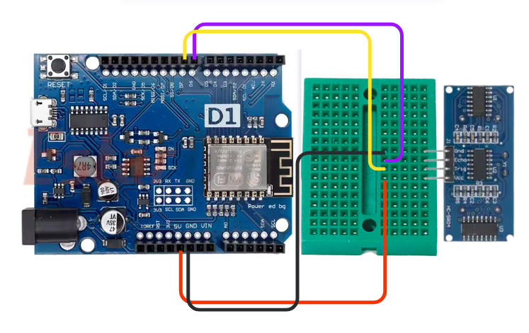
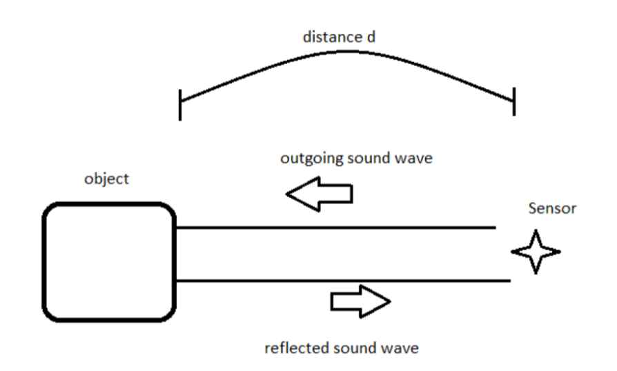

## Project Overview

We will learn about the ultrasonic sensor - how it works and how to use it with your WIFI wheeler


## Materials

Need materials?  [Purchase the WIFI Wheeler kit at our e-store](https://shop.barnabasrobotics.com/products/barnabas-wifi-wheeler-wifi-enabled-2wd-dc-motor-car-kit-ages-11?_pos=1&_psq=wifi+wheeler&_ss=e&_v=1.0).  

Classroom sets available.  Contact us at info@barnabasrobotics.com to inquire. 


## Lesson

### The Ultrasonic Sensor



Our ultrasonic sensor is going to give our robot the ability to sense the world around it.  It almost looks like it's staring at you, right? On the front side there are two large speaker-like objects.  On its backside it has a lot of parts (resistors, capacitors, ICs).  The only thing we need to worry about are those speaker-like objects and the four pins sticking out from the bottom of the board.

Those four pins are labeled **Vcc**, **Trig**, **Echo** and **GND**. The pin labeled GND, unsurprisingly must be connected to the GND pin on our Barnabas Uno board.  The Vcc pin is the power pin of the sensor, so it will be connected to 5V of the Uno.

That leaves only the Trig and Echo pins to explain. 

Uno and will be programmed as an output. 

The Echo pin is an input pin.  It will be used to listen for sounds coming back to the sensor. This pin will be connected to the Uno and will be programmed as an input. 

### Wiring The Ultrasonic Sensor

#### Breadboarding Background

You'll need to use the breadboard in order to wire the ultrasonic sensor to your WIFI Wheeler controller.  Watch this short video on some background of how the breadboard works.



Now place your sensor onto your breadboard (see below).

Notes: 

- Each of the four pins are on its own row (i.e. they are not connected with each other)
- The speakers of the ultrasonic sensor are facing out in front of the wheeler



##### Ultrasonic Sensor Wiring Chart

The wiring chart below shows the connections that we need to make between the ultrasonic sensor and the Uno.

| Ultrasonic Sensor | Uno  | Type of Connection |
| ----------------- | ---- | ------------------ |
| Vcc               | 5V   | Power (+)          |
| Trig              | D7   | Output             |
| Echo              | D6   | Input              |
| Gnd               | Gnd  | Power (-)          |

### 

### Coding the Ultrasonic Sensor

#### Science



Before we start coding, we need to first understand the science of how this sensor works.  Let's first go over how the ultrasonic sensor sends and receives signals.  The diagram on the right shows how a sensor sends an outgoing sound to an object which is reflected back to the sensor when it bounces off the same object.  The sensor does some math on the time that it takes the initial sound to come back to the sensor to find out how far away the object is.  This is how animals like bats and whales use echo location to tell how far objects are.  

#### The Math 

Now that we know the science behind echo location, let's use some math to figure out a formula to calculate distance from the sound.

We're going to use a formula that gives us distance from time and speed.

<p align="center"><b>Distance = Speed x Time </b></p>

We know that the speed of sound in air is *340 meters/second*, so if we know the time, we can then solve for distance!


You might think that our math is done, but not quite yet!  If we follow the path of the sound, it needs to travel to the object, bounce off of the object, and then travel back to the sensor. 

Therefore, the distance that the sound wave travels is actually *twice* the distance between the sensor and the object. 

For that reason the equation describing the distance read by the sensor is as follows:

<p align="center"><b>2 x Distance = 340m/s x time</b></p>

This is the equation we will use in our computer code for the sensor to behave appropriately.  If you're using block-coding, you won't need to code the formula as it is built into the block for you.  However, it's still good to know what is going on behind the scenes!

#### The Code

Below is the ultrasonic function found in your [original sample code](https://github.com/BarnabasRobotics/WIFI-Wheeler/blob/main/wifi_wheeler.ino).  It triggers the ultrasonic sensor, waits for an echo response, does the calculations (see math above), and then returns the distance value in centimeters.

```c++
int ultrasonic() {
  
    long time;
    float distance;
    
    //-trigger a sound 
    // send out trigger signal
    digitalWrite(TRIGGER, LOW);
    delayMicroseconds(2);
    digitalWrite(TRIGGER, HIGH);
    delayMicroseconds(20);
    digitalWrite(TRIGGER, LOW);
    
    //- a sound has gone out!!
    //- wait for a sound to come back
    time = pulseIn(ECHO, HIGH);
    
    //- calculate the distance in centimeters
    distance = 0.01715 * time;
    
    return distance;

}

```

The code snippet below (also in your original code) shows that pressing "6" from the app will trigger this function and reply back with the distance reading

```c++
else if (cmd == "6") {
    //-code here
    //-sense distace of nearest object
    cmd = cmd + " = " + ultrasonic() + " cm";
}
```

#### Test Your Sensor

Now that you know the theory, and you've wired up your ultrasonic sensor, try reading the value from your ultrasonic sensor using the iPhone/Android app.  

Move your hand back and forth the see the distance reading change.

#### Move To An Object

Below is code that use the ultrasonic() function to move toward an object until it is 5 cm away.  See if you can understand the code.  It is basically saying, keep moving forward and keep testing the distance as long as the distance is greater than 5 cm.  Once distance is greater than 5 cm, jump out of the loop and stop all motors.

```c++
void moveToObject() {
    int distance;
    distance = ultrasonic();
    
    while (distance > 5) {
        moveForward();
        distance = ultrasonic();  
        delay(100);
    }
    stopAllMotors();
}
```
The code snippet below (also in your original code) shows that pressing "5" from the app will trigger this function

```c++
else if (cmd == "5") {
    //-code here
    moveToObject();
}
```

#### Time To Play

Try to trigger your moveToObject() function using your app and see if it stops once it sees an object that is 5 cm away or closer.  Once you get that working, here are a few challenges

- Change code so that it stops 10 cm away
- Change code so that it stops 5 cm away
- Add code so that once it stops, it goes backwards a little bit and turns
